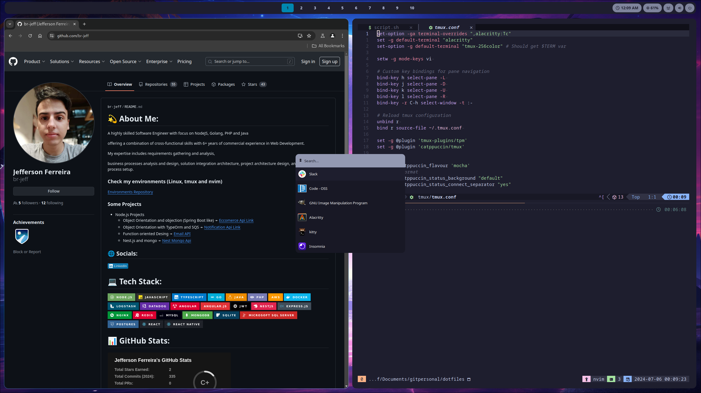
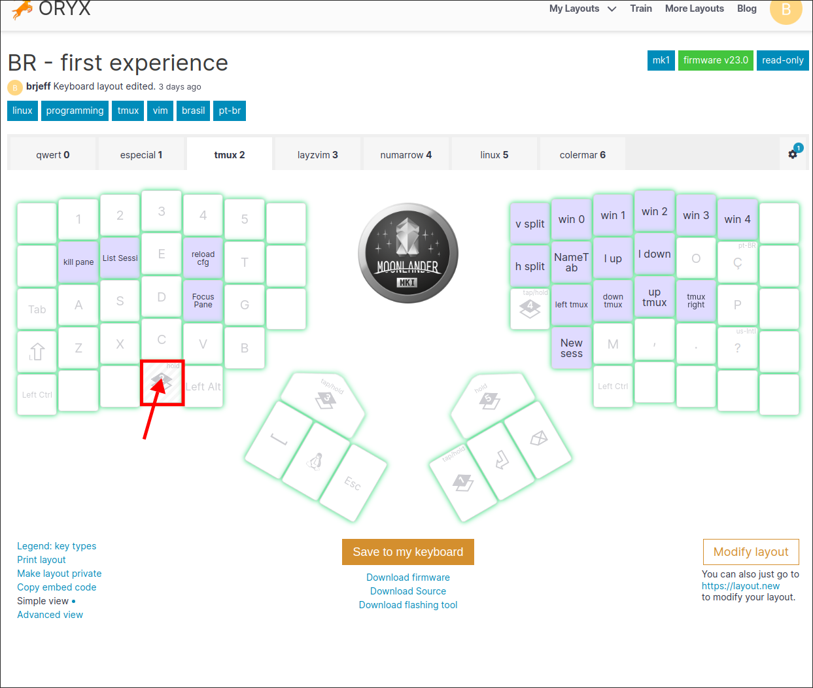

<h2 align="center"> Ubuntu Configurations  </h2>


## Apresentation


<table align="center">
  <tr>
    <th>Plataform</th>
    <th>Name</th>
  </tr>
  <tr>
    <td>System</td>
    <td>Debian Ubuntu</td>
  </tr>
  <tr>
    <td>Window Manager</td>
    <td>I3WM</td>
  </tr>
  <tr>
    <td>Status Bar</td>
    <td>i3Status</td>
  </tr>
  <tr>
    <td>Shell</td>
    <td>ZSH</td>
  </tr>
  <tr>
    <td>Terminal</td>
    <td>Alacritty</td>
  </tr>
  <tr>
    <td>Terminal Multiplexing</td>
    <td>Tmux</td>
  </tr>
  <tr>
    <td>Code Editor</td>
    <td>Nvim (layz)</td>
  </tr>
</table>

## Instalation with script
If you want to run script.sh, you should have the .dotfiles repository in your home folder. You also need to install the fonts in the Ubuntu folder.

## Introdution
This environment is designed for use with GNU Stow. Each folder represents a separate module, and the files within these folders are organized based on their intended locations in the HOME directory. 

```
stow --adopt $FOLDER_MODULE
```

You could install GNUStow with comand 

``` sudo apt install stow  ```

for more information see  https://www.gnu.org/software/stow/


###### Don't install the Wayland module if you're using i3wm.

# Requerimetns

### Instalation

First, you will need to install apt-packages.sh to have essential packages. You will also need to install all the fonts in the Ubuntu folder.

Now You have two options, using UBUNTU gnome interface or I3WM

#### I3WM
for I3WM widownn manager you need to run i3wm.sh, and use stow on modules, rofi, dunst and i3wm


#### Ubuntu

For Ubuntu option you need to run ubuntu-wm.sh for remove all default gnome shotcuts, you also need to install Forge gnome extension to have make windown manager.


### ZSH and ASDF

To get nvim working with everything set up, you should have ASDF installed. ASDF is configured with Zinit on ZSH, so you don’t need to install it separately—just link your .zshrc file.

By default, ZSH will start with ASDF global versions. This prevents Mason from crashing and eliminates the need to set the global version for every project that doesn't have a .tool-versions file.
You can see versions on script.sh file.

### Neovim

Neovim is configured with LSP for Java, JavaScript, TypeScript, and Go. 
Install JDTLS with Mason, and everything should work, including auto-imports. If you're working with Java and don’t have LSP features functioning, check if the options in `nvim/ftplugin/java.lua` are correctly set.

When starting Neovim, you should not see any errors. If you do, please update Neovim and check if the global ASDF settings are working by running script.sh 

## Setup
I use Moonlander from ZSA with a custom layout featuring layers for tmux, gnome and nvim. To optimize my workflow, I prefer crafting macros rather than relyng solely on configurations.
You can use my layout with the link below:

```
https://configure.zsa.io/moonlander/layouts/YVjWy/LLpoX/0
```

## I3WM Or Ubuntu WM

<table align="center">
  <tr>
    <th>Key Combination</th>
    <th>Action</th>
  </tr>
   <tr>
    <td>SUPER + T</td>
    <td>Open alacritty</td>
  </tr>
  <tr>
    <td>SUPER + C</td>
    <td>Open Google Chrome</td>
  </tr>
  <tr>
    <td>SUPER + B</td>
    <td>Open Laucher for search</td>
  </tr>
  <tr>
    <td>SUPER + Q</td>
    <td>Close window</td>
  </tr>
   <tr>
    <td>SUPER + H</td>
    <td>Focus right windown</td>
  </tr> 
  <tr>
    <td>SUPER + J</td>
    <td>Focus down windown</td>
  </tr> 
  <tr>
    <td>SUPER + K</td>
    <td>Focus up windown</td>
  </tr>
   <tr>
    <td>SUPER + L</td>
    <td>Focus right windown</td>
  </tr> 
   <tr>
   <td>SUPER + F</td>
    <td>Active Windown fullscreen</td>
  </tr> 
   <tr>
   <td>SUPER + Y</td>
    <td>Change tile direction</td>
  </tr> 
  <tr>
   <td>SUPER + M</td>
    <td>Exit system</td>
  </tr> 
  <tr>
   <td>SUPER + 1 </td>
    <td>Change to workspace 1</td>
  </tr> 
   <tr>
   <td>SUPER + 2 </td>
    <td>Change to workspace 2</td>
  </tr> 
   <tr>
   <td>SUPER + 3 </td>
    <td>Change to workspace 3</td>
  </tr> 
   <tr>
   <td>SUPER + 4 </td>
    <td>Change to workspace 4</td>
  </tr> 
   <tr>
   <td>SUPER + 5 </td>
    <td>Change to workspace 5</td>
  </tr> 
   <tr>
   <td>SUPER + 6 </td>
    <td>Change to workspace 6</td>
  </tr> 
   <tr>
   <td>SUPER + 7 </td>
    <td>Change to workspace 8</td>
  </tr> 
   <tr>
   <td>SUPER + 9 </td>
    <td>Change to workspace 9</td>
  </tr> 
   <tr>
   <td>SUPER + 0 </td>
    <td>Change to workspace 10</td>
  </tr> 
   <tr>
   <td>SUPER + SHIFT + 1 </td>
    <td>Move focus windown to workspace 1</td>
  </tr> 
    <tr>
   <td>SUPER + SHIFT + 2 </td>
    <td>Move focus windown to workspace 2</td>
  </tr> 
    <tr>
   <td>SUPER + SHIFT + 3 </td>
    <td>Move focus windown to workspace 3</td>
  </tr> 
    <tr>
   <td>SUPER + SHIFT + 4 </td>
    <td>Move focus windown to workspace 4</td>
  </tr> 
    <tr>
   <td>SUPER + SHIFT + 5 </td>
    <td>Move focus windown to workspace 5</td>
  </tr> 
    <tr>
   <td>SUPER + SHIFT + 6 </td>
    <td>Move focus windown to workspace 6</td>
  </tr> 
    <tr>
   <td>SUPER + SHIFT + 7 </td>
    <td>Move focus windown to workspace 7</td>
  </tr> 
    <tr>
   <td>SUPER + SHIFT + 8 </td>
    <td>Move focus windown to workspace 8</td>
  </tr> 
    <tr>
   <td>SUPER + SHIFT + 9 </td>
    <td>Move focus windown to workspace 9</td>
  </tr> 
    <tr>
   <td>SUPER + SHIFT + 0 </td>
    <td>Move focus windown to workspace 0</td>
  </tr> 
</table>


## Tmux

I use default prefix for tmux (CTRL + b)  but i have a layer on Moonlander.



<table align="center">
  <tr>
    <th>Key Combination</th>
    <th>ZSA Key</th>
    <th>Tmux layer name</th>
    <th>Description</th>
  </tr>
   <tr>
    <td>PREFIX + X + Y </td>
    <td>Q</td>
    <td>kill pane</td>
    <td>Quit currente seesion pressing yes</td>
  </tr>
   <tr>
    <td>PREFIX + W</td>
    <td>W</td>
    <td>List Sessi </td>
    <td>List Sessions</td>
  </tr>
  <tr>
    <td>PREFIX + r </td>
    <td>R</td>
    <td>reload cfg</td>
    <td>Source tmux file</td>
  </tr>
   <tr>
    <td>PREFIX + z </td>
    <td>F</td>
    <td>Focus Pane</td>
    <td>Pane will became full screen</td>
  </tr>
    <tr>
    <td>PREFIX + % </td>
    <td> Custom </td>
    <td>v split</td>
    <td>Split vertically </td>
  </tr>
  <tr>
    <td>PREFIX + " </td>
    <td> Custom </td>
    <td>h split</td>
    <td>Split horizontally </td>
  </tr>
   <tr>
    <td>PREFIX +  </td>
        <td>Y</td>
    <td>nameTab</td>
    <td>Name/rename a tab</td>
  </tr>
   </tr>
   <tr>
    <td>PREFIX + PgUp </td>
        <td>U</td>
    <td>l up</td>
    <td>PageUP view mode to scroll terminal</td>
  </tr>
    <tr>
    <td>PREFIX + PgDown </td>
        <td>i</td>
    <td>l down</td>
    <td>PageDown view mod to scroll terminal</td>
  </tr>
  <tr>
    <td>PREFIX + Arrow left </td>
        <td>H</td>
    <td>left tmux</td>
    <td>Move to left pane</td>
  </tr>
   <tr>
    <td>PREFIX + Arrow down </td>
        <td>J</td>
    <td>down tmux</td>
    <td>Move to down pane</td>
    <tr>
     <tr>
    <td>PREFIX + Arrow up </td>
        <td>K</td>
    <td>up tmux</td>
    <td>Move to up pane</td>
    <tr>
    <td>PREFIX + Arrow right </td>
        <td>L</td>
    <td>left tmux</td>
    <td>Move to left pane</td>
  </tr>
    <tr>
    <td>PREFIX + 0 </td>
        <td>6</td>
    <td>win 0</td>
    <td>Move to tab 0</td>
  </tr>
    </tr>
    <tr>
    <td>PREFIX + 1 </td>
        <td>7</td>
    <td>win 1</td>
    <td>Move to tab 1 </td>
  </tr>
    </tr>
    <tr>
    <td>PREFIX + 2 </td>
        <td>8</td>
    <td>win 2</td>
    <td>Move to tab 2</td>
  </tr>
   </tr>
    <tr>
    <td>PREFIX + 3 </td>
        <td>9</td>
    <td>win 3</td>
    <td>Move to tab 3</td>
  </tr>
 </tr>
    <tr>
    <td>PREFIX + 4 </td>
        <td>0</td>
    <td>win 4</td>
    <td>Move to tab 4</td>
  </tr>
</table>
